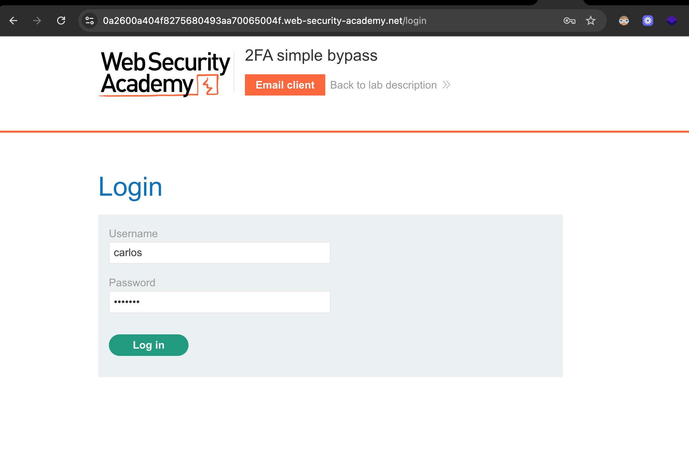
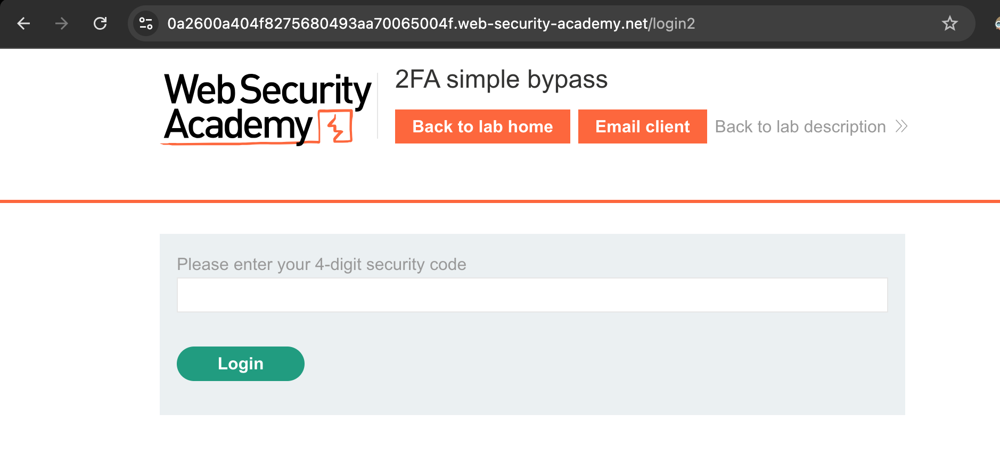
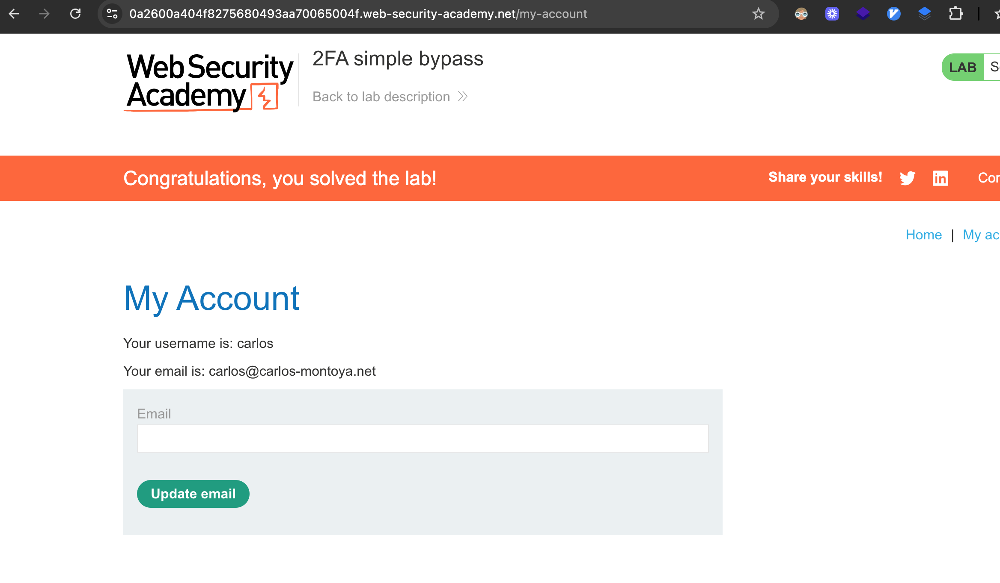

# Challenge: 2FA simple bypass

Category: Broken Authentication
Difficulty: Apprentice

## Challenge Description

This lab's two-factor authentication is vulnerable due to a flaw in its logic. To solve the lab, access Carlos's account page.

## Resource

[PortSwigger - 2FA simple bypass](https://portswigger.net/web-security/authentication/multi-factor/lab-2fa-simple-bypass)

## Step-by-Step Solution

1.  Akses lab, pergi ke halaman login, dan masuk menggunakan kredensial `carlos` dan `montoya`.
    

2.  Setelah berhasil memasukkan kredensial, aplikasi akan mengarahkan kita ke halaman verifikasi 2FA untuk memasukkan kode.
    

3.  Jangan masukkan kode apa pun. Alih-alih, ubah path URL di browser secara manual dari `/login2` menjadi `/my-account` dan tekan Enter.

4.  Aplikasi gagal memverifikasi apakah pengguna telah menyelesaikan langkah 2FA, sehingga kita langsung diberikan akses ke halaman akun Carlos. Lab berhasil diselesaikan.
    

## Reflection

- **Status:** ✅ Berhasil
- **Root Cause:** Terdapat kelemahan dalam logika alur autentikasi. Aplikasi memberikan sesi yang terotentikasi kepada pengguna setelah faktor pertama (password) diverifikasi, tetapi sebelum faktor kedua (kode 2FA) divalidasi.
- **Attack Vector:** Bypass alur 2FA dengan melakukan navigasi paksa (forced browsing) ke endpoint yang dituju (`/my-account`) setelah login awal berhasil.
- **Key Insight:**
  - Sebuah sesi pengguna tidak boleh dianggap sepenuhnya "terpercaya" atau "terotentikasi" sampai semua langkah verifikasi multi-faktor telah berhasil diselesaikan.
  - Aplikasi seharusnya mengimplementasikan sebuah status sementara (misalnya, `pending_2fa`) untuk sesi setelah login password berhasil, dan hanya memberikan akses penuh setelah kode 2FA yang valid diberikan.
  - Kelemahan ini memungkinkan penyerang yang mengetahui kredensial untuk sepenuhnya melewati perlindungan 2FA.
