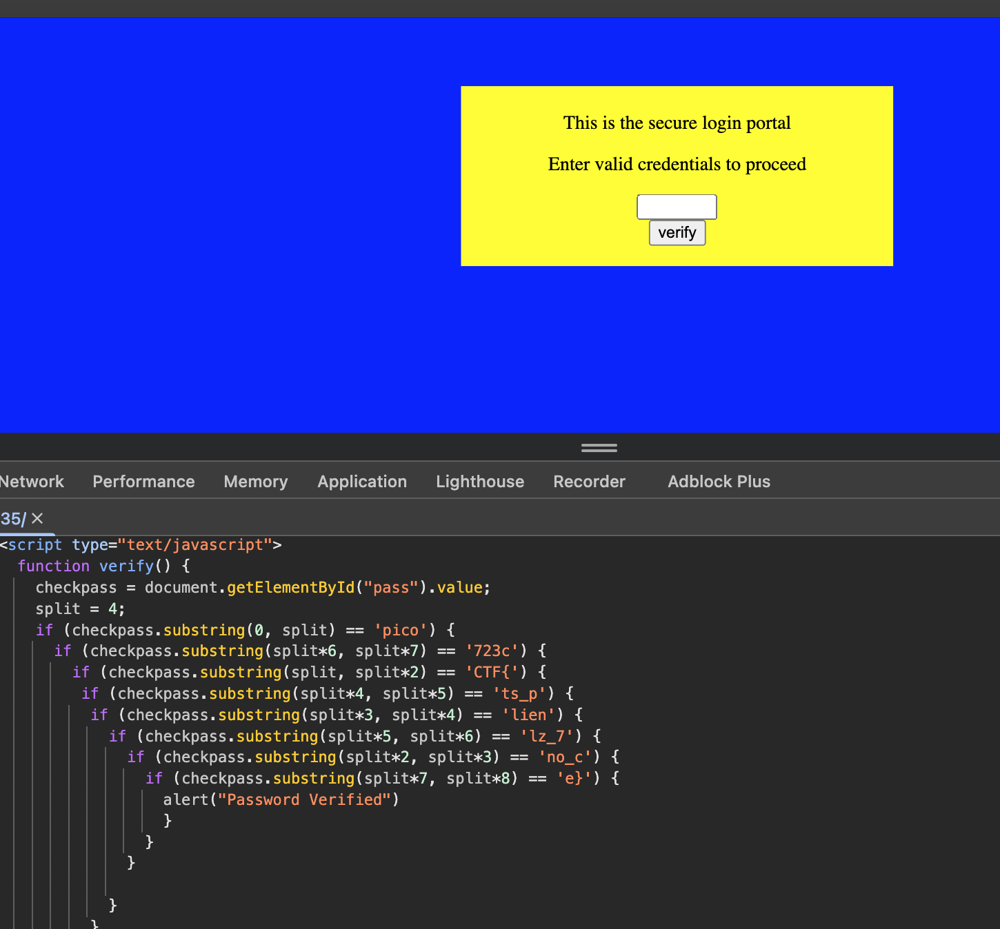

# Challenge: Don't Use Client Side

Category: Web Exploitation / Reverse Engineering
Difficulty: Easy

## Challenge Description

Can you get the flag?

## Resource

[picoCTF - Don't Use Client Side](https://play.picoctf.org/practice/challenge/17)

## Step-by-Step Solution

1.  Buka halaman web dan lihat source code-nya (Ctrl+U atau klik kanan > View Page Source).
    

2.  Di dalam source code, kita menemukan sebuah file JavaScript `index.js`. Di dalamnya terdapat fungsi `verify()` yang digunakan untuk memeriksa password.

3.  Analisis fungsi `verify()` menunjukkan bahwa password diperiksa bagian per bagian dalam urutan yang tidak berurutan. Kita perlu menyusunnya kembali untuk mendapatkan flag yang benar.
    ```javascript
    function verify() {
        var checkpass = document.getElementById("pass").value;
        var split = 4;
        if (checkpass.substring(0, split) == "pico") {
          if (checkpass.substring(split*6, split*7) == "706c") {
            if (checkpass.substring(split, split*2) == "CTF{") {
             if (checkpass.substring(split*4, split*5) == 'ts_p') {
              if (checkpass.substring(split*3, split*4) == 'lien') {
               if (checkpass.substring(split*5, split*6) == 'lz_b') {
                if (checkpass.substring(split*2, split*3) == 'no_c') {
                 if (checkpass.substring(split*7, split*8) == '5}') {
                  alert("Password Verified")
                  }
                 }
                }
               }
              }
             }
            }
          }
        }
    ```

4.  Dengan menyusun semua bagian `substring` sesuai urutannya, kita dapat merekonstruksi flag:
    - `checkpass.substring(0, 4)` -> `pico`
    - `checkpass.substring(4, 8)` -> `CTF{`
    - `checkpass.substring(8, 12)` -> `no_c`
    - `checkpass.substring(12, 16)` -> `lien`
    - `checkpass.substring(16, 20)` -> `ts_p`
    - `checkpass.substring(20, 24)` -> `lz_b`
    - `checkpass.substring(24, 28)` -> `706c`
    - `checkpass.substring(28, 32)` -> `5}`

5.  Gabungkan semua bagian untuk mendapatkan flag lengkap.

## Reflection

- **Status:** ✅ Berhasil
- **Root Cause:** Validasi password dilakukan sepenuhnya di sisi klien (client-side) menggunakan JavaScript. Kode validasi ini dapat dengan mudah dilihat dan dianalisis oleh siapa saja yang membuka source code halaman.
- **Attack Vector:** Menganalisis (mereverse-engineer) logika JavaScript di sisi klien untuk menemukan password yang benar tanpa perlu menebaknya.
- **Key Insight:**
  - Jangan pernah menempatkan logika keamanan yang sensitif, seperti validasi password atau flag, di sisi klien.
  - Kode client-side (HTML, CSS, JavaScript) bersifat publik dan tidak dapat dipercaya untuk menjaga kerahasiaan.
  - Dengan membaca alur logika pada fungsi `verify()`, flag dapat disusun kembali potong demi potong.
- **Flag:** `picoCTF{no_clients_plz_b706c5}`