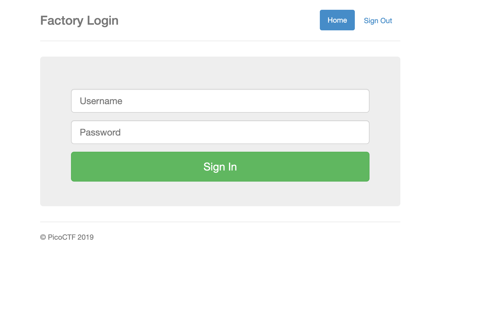
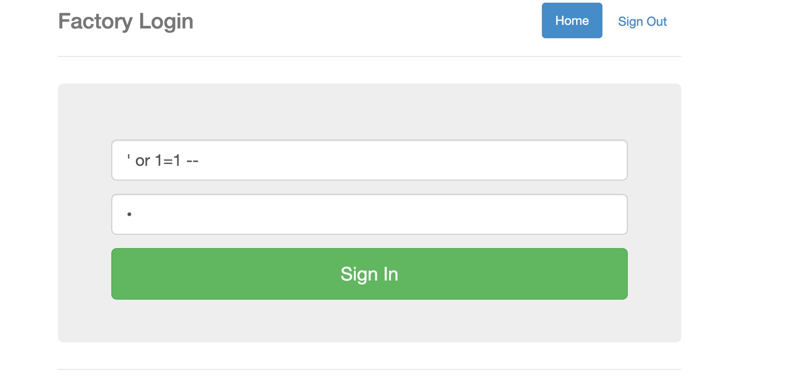
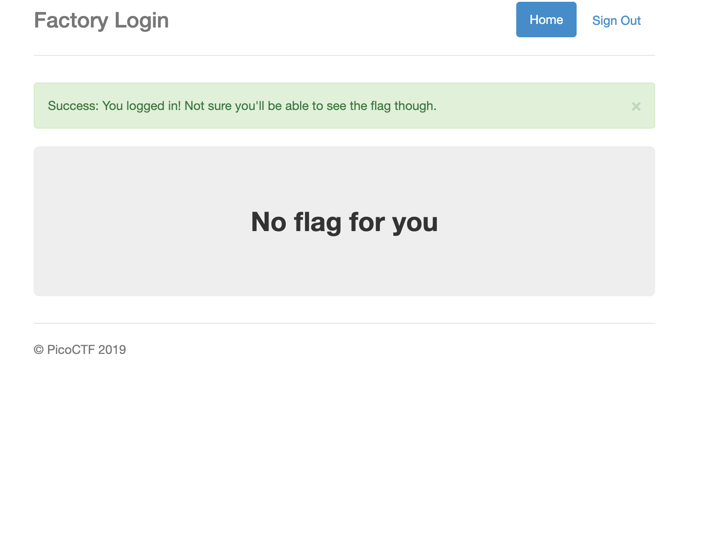
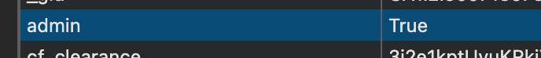
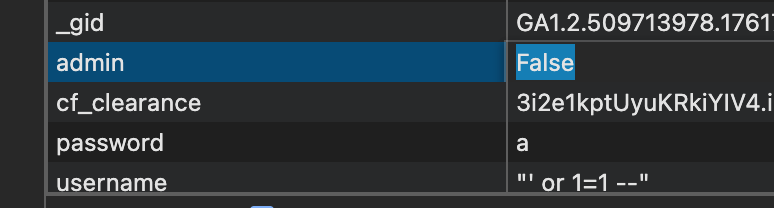
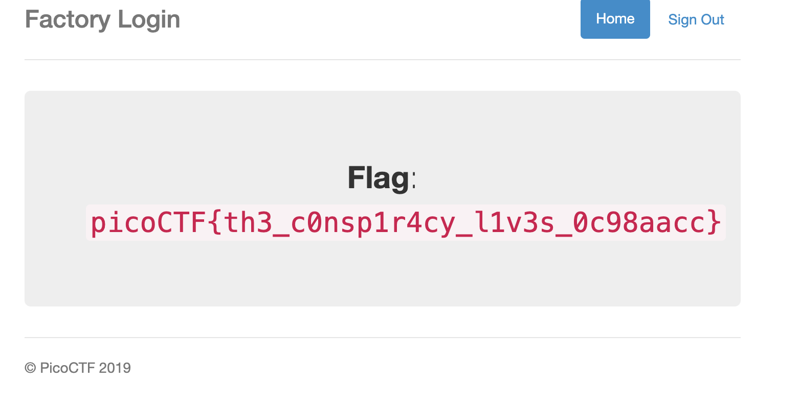

# Challenge: Logon

Category: Broken Authentication
Difficulty: Easy

## Challenge Description

The factory is hiding things from all of its users. Can you log in and find out what they are?

## Resource

[picoCTF - Logon](https://play.picoctf.org/practice/challenge/46?page=1&search=logon)

## Step-by-Step Solution

1.  Pergi ke web yang disediakan.
    
2.  Gunakan payload SQL Injection `' or 1=1--` untuk bypass halaman login.
    
3.  Setelah berhasil login, kita belum mendapatkan flag.
    
4.  Periksa cookies pada browser. Terlihat ada cookie `admin` dengan nilai `False`.
    
5.  Ubah nilai cookie `admin` dari `False` menjadi `True`.
    
6.  Refresh halaman untuk mendapatkan flag.
    

## Reflection

- **Status:** ✅ Berhasil
- **Root Cause:**
  - Validasi input yang tidak memadai pada form login, memungkinkan SQL Injection.
  - Otorisasi yang lemah karena menggunakan parameter yang dapat dikontrol oleh pengguna (cookie) untuk menentukan hak akses admin.
- **Attack Vector:**
  - SQL Injection pada halaman login untuk bypass autentikasi.
  - Manipulasi cookie untuk eskalasi privilese dari pengguna biasa menjadi admin.
- **Key Insight:**
  - Autentikasi berhasil dilewati menggunakan payload SQLi klasik `' or 1=1--`.
  - Hak akses admin ternyata hanya dikontrol oleh sebuah cookie `admin` yang nilainya `False`.
  - Dengan mengubah nilai cookie menjadi `True`, kita bisa mendapatkan hak akses admin dan melihat flag yang tersembunyi.
  - Ini menunjukkan betapa berbahayanya menyimpan state otorisasi di sisi klien tanpa validasi di sisi server.
- **Flag:** `picoCTF{th3_c0nsp1r4cy_l1v3s_0c98aacc}`
