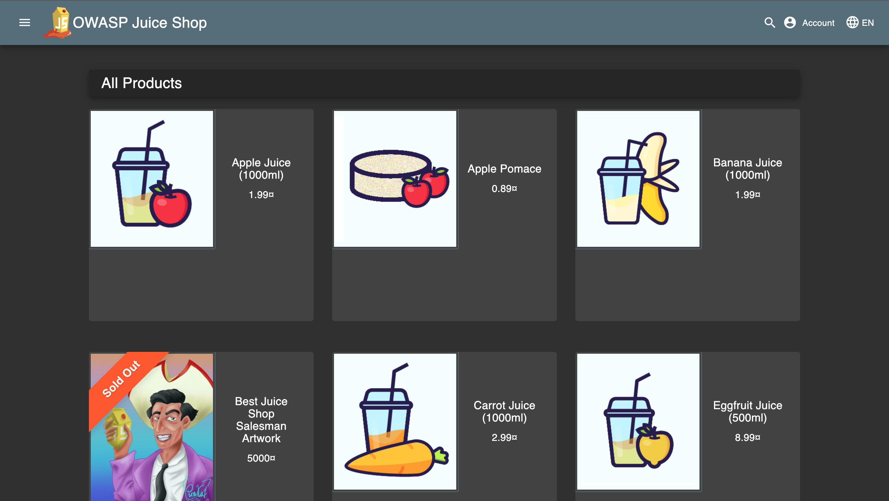
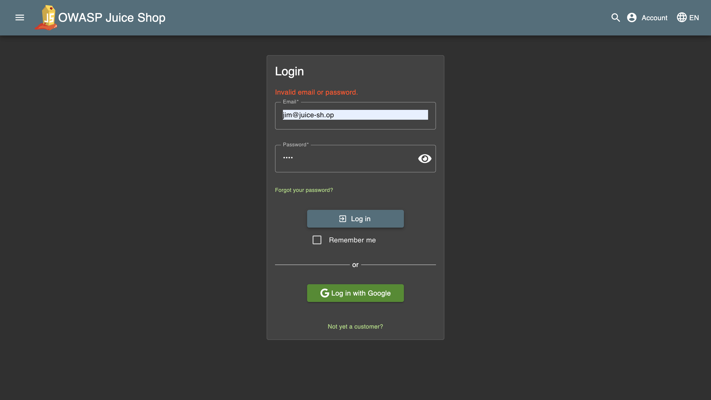
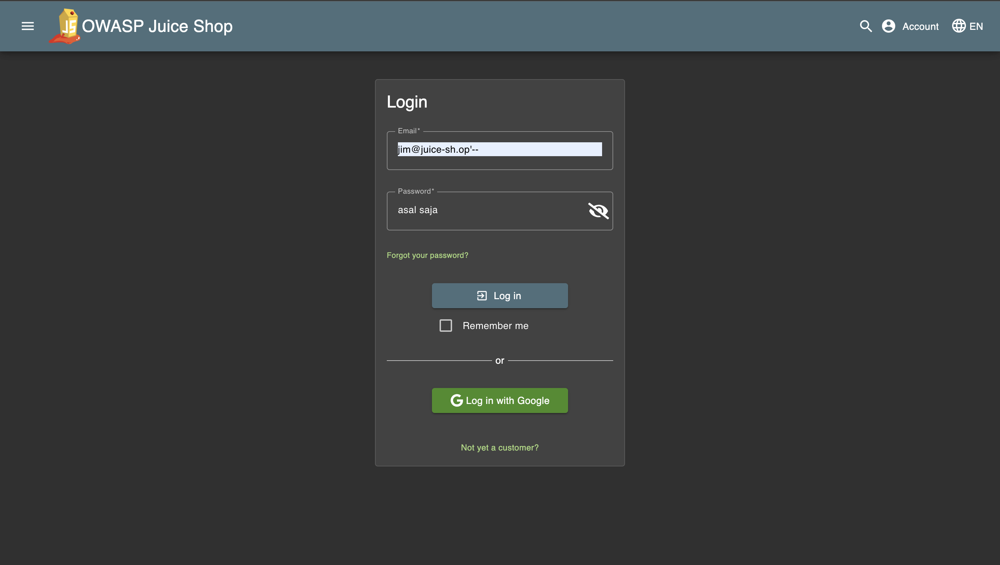
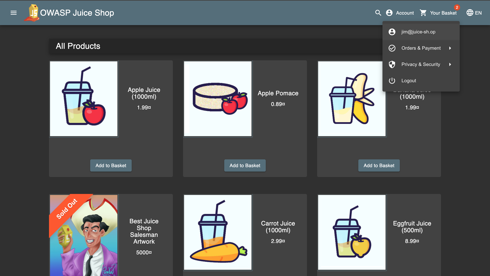

# Challenge: Login Jim (SQL Injection)

## Resource

[OWASP Juice Shop - Injection Challenges](https://juice-shop.herokuapp.com/#/score-board?categories=Injection)

## Step-by-Step Solution

1. Kita coba cari email jim di product reviews
   
2. Disini kita menemukan email dari Jim
   
3. Kita ke login page dan input email jim dan coba login tapi disini kita belum tau password
   
4. Tambahkan `'--` pada kolom email setelah `jim@juice-sh.op` untuk memanfaatkan kerentanan SQL Injection.
   
5. Kita berhasil login menggunakan akun jim
   

## Reflection

- Status: ✅ Berhasil
- Catatan: Kueri SQL tidak memiliki validasi input => bypass autentikasi tercapai.
