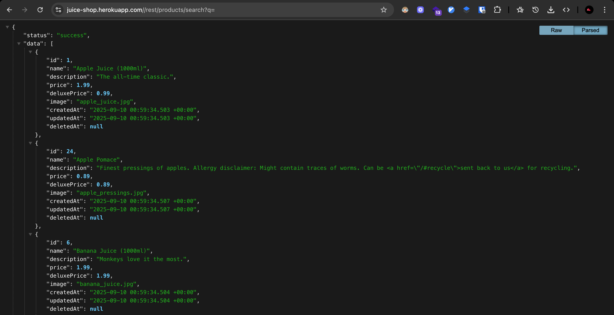
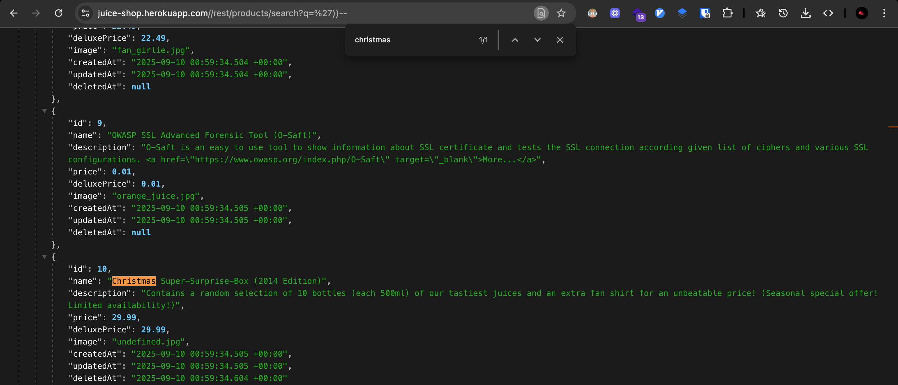
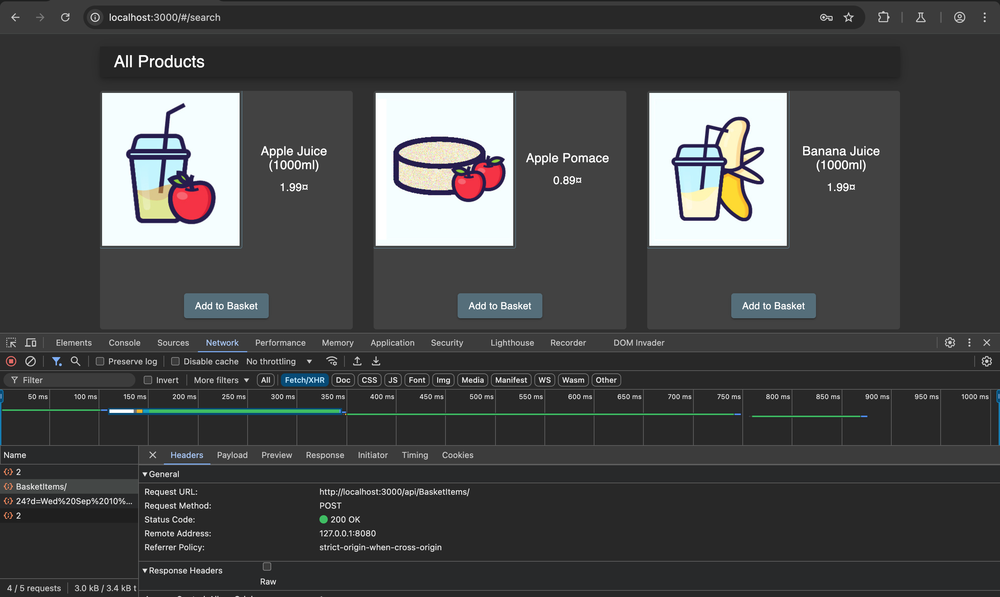
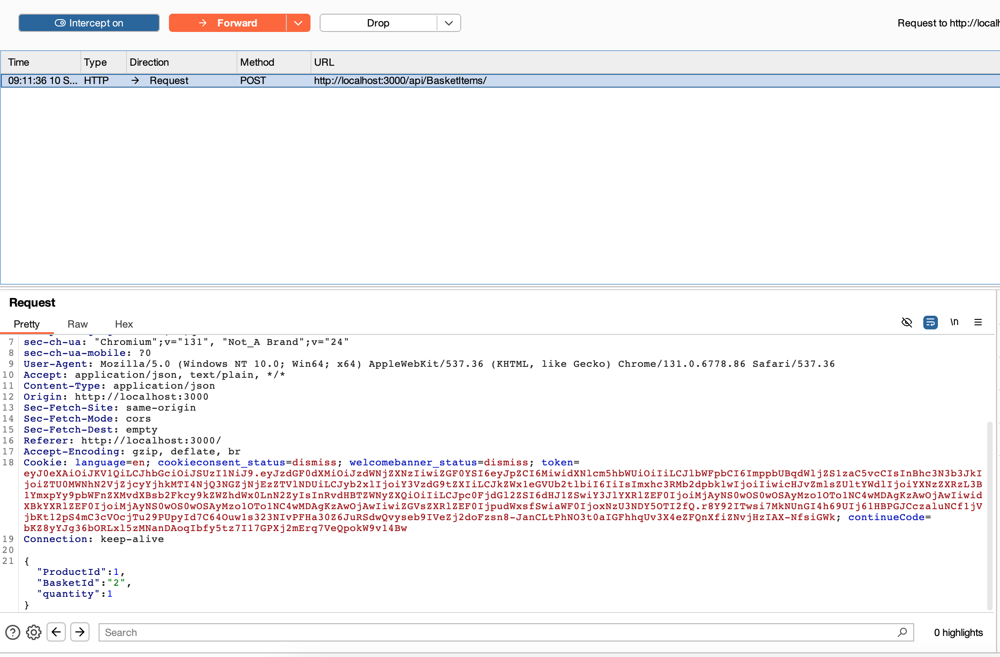
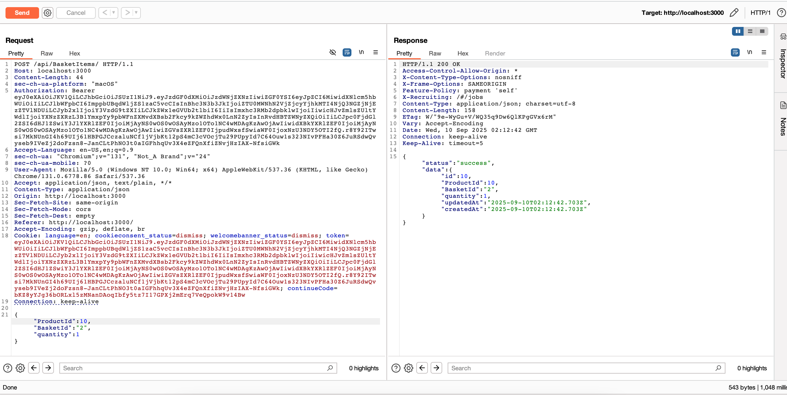
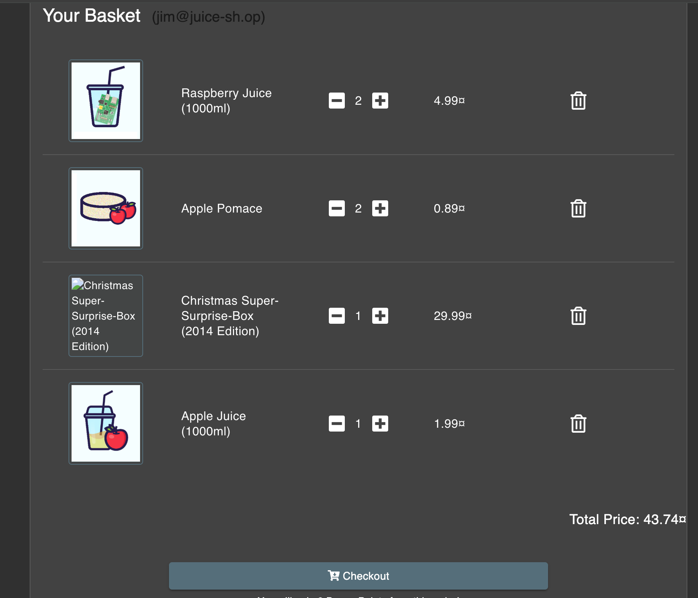
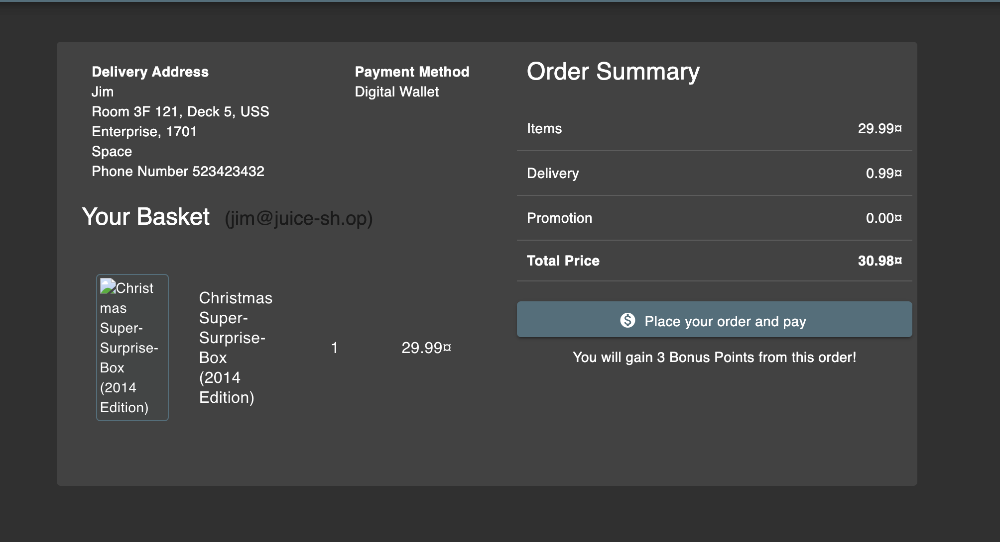

# Challenge: Ephemeral Accountant

Category: Injection
Points: 4 Stars
Difficulty: Medium

## Challenge Description

Order the Christmas special offer of 2014.

## Resource

[OWASP Juice Shop - Injection Challenges](https://juice-shop.herokuapp.com/#/score-board?categories=Injection)

## Step-by-Step Solution

1. Disini kita bisa liat bahwa endpoint tersebut mengembalikan product yang belum dihapus dari `"deletedAt": null`
   

2. Lalu kita bisa cari dengan payload `%27))--` dan search christ untuk mendapatkan
   
3. Sekarang kita akan masukkan ke keranjang, kita dapatkan endpoint /api/basketitems
   
4. Kita dapatkan requestnya lalu kita edit di repeater
   
5. Masukkan ke keranjang
   
   
6. Kita order
   
7. Berhasil order
   

## Reflection

- **Status:** ✅ Berhasil
- **Root Cause:** Endpoint search tidak memiliki validasi input yang proper untuk SQL injection
- **Attack Vector:** SQL injection melalui parameter search untuk mengakses data yang sudah dihapus
- **Key Insight:**
  - Berhasil menggunakan SQL injection untuk bypass filter `deletedAt IS NULL`
  - Payload `%27))--` memungkinkan akses ke produk yang sudah dihapus (soft delete)
  - Demonstrasi bagaimana SQL injection bisa digunakan untuk mengakses data yang seharusnya tidak terlihat
  - Teknik ini memungkinkan akses ke Christmas special offer 2014 yang sudah tidak aktif
  - URL encoding `%27` untuk single quote memungkinkan bypass input validation
