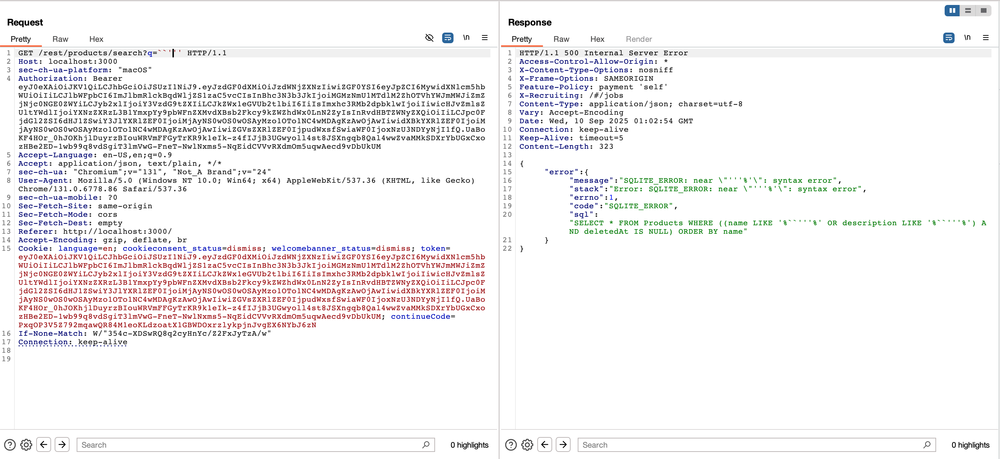
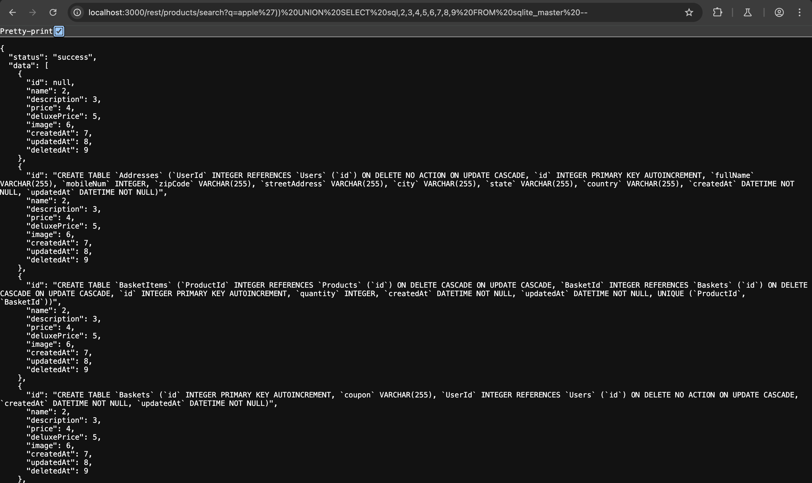

# Challenge: Database Schema

Category: Injection
Points: 3 Stars
Difficulty: Medium

## Challenge Description

Exfiltrate the entire DB schema definition via SQL Injection.

## Resource

[OWASP Juice Shop - Injection Challenges](https://juice-shop.herokuapp.com/#/score-board?categories=Injection)

## Step-by-Step Solution

1. Kita buka network tab lalu kita liat endpointnya
   

2. Kita coba kirim request yang memunculkan error
    disini kita bisa melihat query SQL yang digunakan pada search query, kita bisa memanfaatkan itu
3. Lalu kita masukkan SQL Injection seperti berikut
   

## Reflection

- **Status:** ✅ Berhasil
- **Root Cause:** Endpoint search tidak memiliki validasi input yang proper untuk SQL injection
- **Attack Vector:** SQL injection melalui parameter search query
- **Key Insight:**
  - Error message menampilkan struktur query SQL yang digunakan
  - Berhasil mengeksploitasi UNION-based SQL injection untuk exfiltrate database schema
  - Menggunakan teknik information_schema untuk mendapatkan struktur database
  - Demonstrasi bagaimana SQL injection bisa digunakan untuk reconnaissance database
