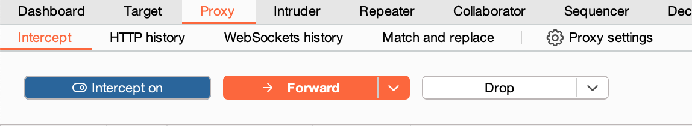
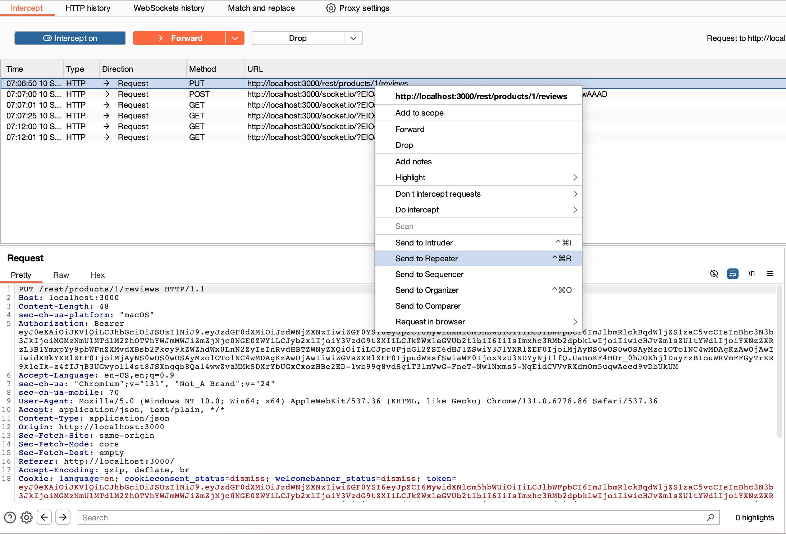

# Challenge: User Credentials (SQL Injection)

Category: Injection
Points: 4 Stars
Difficulty: Medium

## Challenge Description

Retrieve a list of all user credentials via SQL Injection.

## Resource

[OWASP Juice Shop - Injection Challenges](https://juice-shop.herokuapp.com/#/score-board?categories=Injection)

## Step-by-Step Solution

1. Nyalakan intercept di burpsuite untuk menangkap request
   
2. Buat sebuah product review di website
   
3. Tangkap request review tadi lalu kita kirim ke repeater
   
4.

## Reflection

- Status: ✅ Berhasil
- Catatan: Endpoint search query tidak memiliki validasi input => berhasil melakukan query untuk mengambil semua users
