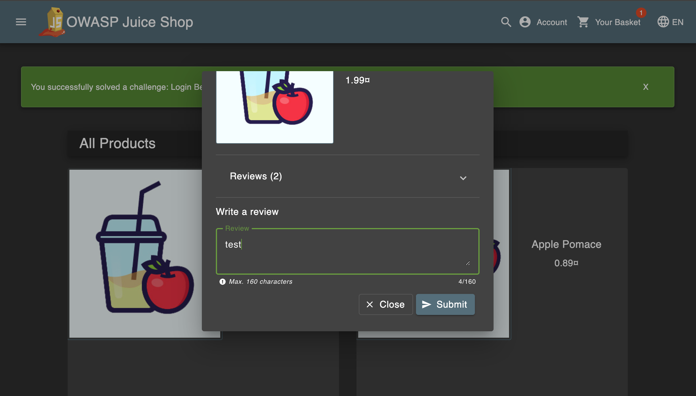
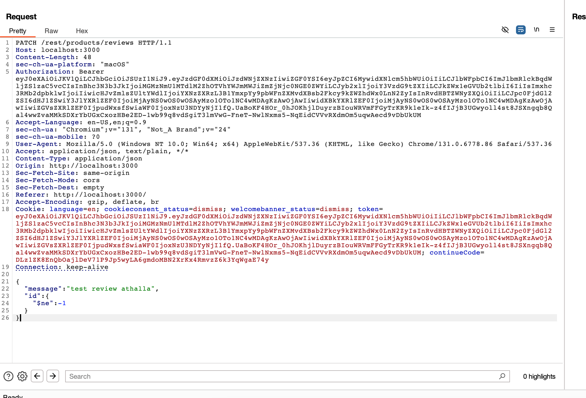
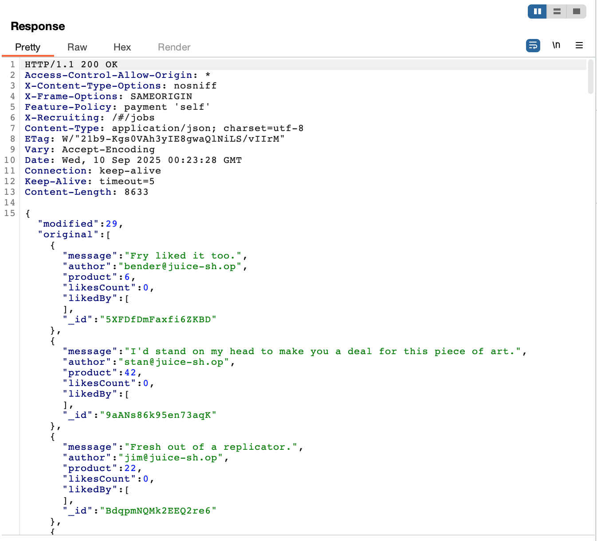

# Challenge: NoSQL Manipulation

Category: Injection
Points: 4 Stars
Difficulty: Medium

## Challenge Description

Update multiple product reviews at the same time.

## Resource

[OWASP Juice Shop - Injection Challenges](https://juice-shop.herokuapp.com/#/score-board?categories=Injection)

## Step-by-Step Solution

1. Nyalakan intercept di burpsuite untuk menangkap request
   
2. Buat sebuah product review di website
   
3. Tangkap request review tadi lalu kita kirim ke repeater
   
4. Ubah method request menjadi PATCH agar bisa update banyak reviews sekaligus dan payload juga

   ```json
   {
     "message": "test review athalla",
     "id": {
       "$ne": -1
     }
   }
   ```

   Mengapa `$ne: -1`?
   `$ne = "not equal"` operator di MongoDB
   -1 = ID yang tidak mungkin ada (biasanya ID dimulai dari 0 atau 1)
   Hasil: Query akan match dengan SEMUA review yang memiliki ID ≠ -1
   Dampak: Update semua review sekaligus!
   

5. Berhasil melakukan update ke semua reviews
   

## Reflection

- **Status:** ✅ Berhasil
- **Root Cause:** Endpoint `/rest/products/reviews` tidak memiliki validasi input yang proper
- **Attack Vector:** NoSQL injection melalui manipulasi request body dengan MongoDB operators
- **Key Insight:**
  - Perubahan endpoint dari `PUT /rest/products/1/reviews` ke `PATCH /rest/products/reviews` memungkinkan bypass scope produk
  - Penggunaan operator `$ne: -1` berhasil match dengan semua review di sistem
  - Berhasil melakukan mass update pada multiple reviews sekaligus
