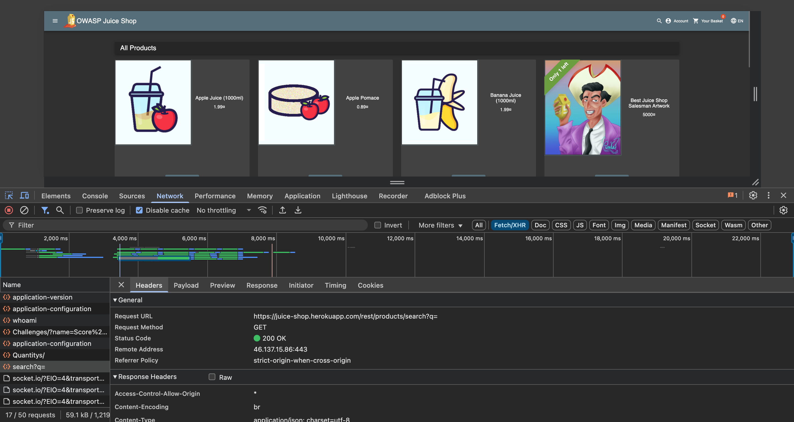
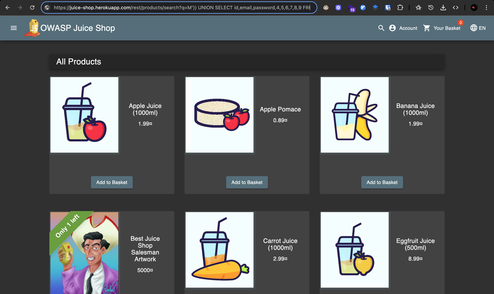
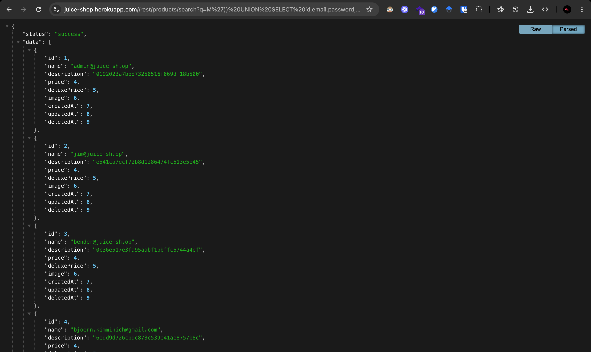

# Challenge: User Credentials

Category: Injection
Points: 4 Stars
Difficulty: Medium

## Challenge Description

Retrieve a list of all user credentials via SQL Injection.

## Resource

[OWASP Juice Shop - Injection Challenges](https://juice-shop.herokuapp.com/#/score-board?categories=Injection)

## Step-by-Step Solution

1. Kita coba cari endpointnya lewat network tab dan lihat cari bagian dia fetch atau call ke backendnya
   
2. Dari endpoint tersebut kita coba masukkan query di URLnya menggunakan:
   `M')) UNION SELECT id,email,password,4,5,6,7,8,9 FROM users--`
   Ini adalah payload SQL Injection. `M'))` digunakan untuk menutup string dan tanda kurung dari kueri asli. `UNION SELECT` menggabungkan hasil kueri ini dengan kueri asli. `id,email,password,4,5,6,7,8,9` adalah kolom yang dipilih, di mana `id`, `email`, dan `password` adalah data sensitif yang ingin kita ambil dari tabel `users`. Angka `4,5,6,7,8,9` adalah placeholder untuk mencocokkan jumlah kolom di kueri asli. `FROM users` menentukan tabel target. `--` mengomentari sisa kueri asli untuk mencegah error sintaks.
   
3. Berhasil mengambil semua users
   

## Reflection

- Status: ✅ Berhasil
- Catatan: Endpoint search query tidak memiliki validasi input => berhasil melakukan query untuk mengambil semua users
