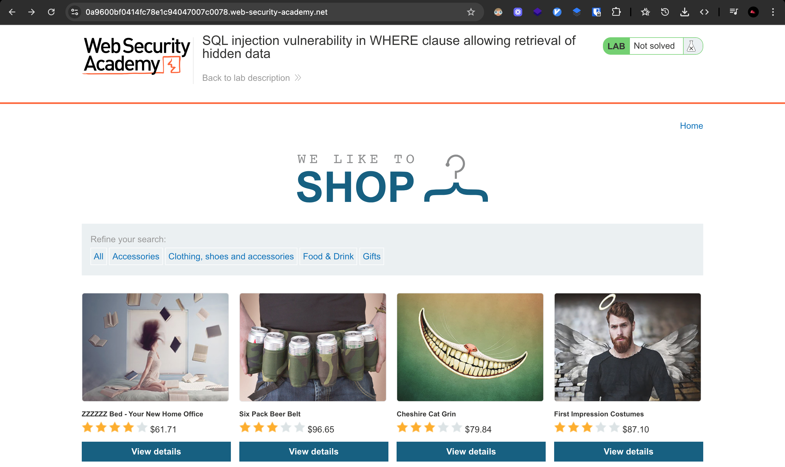
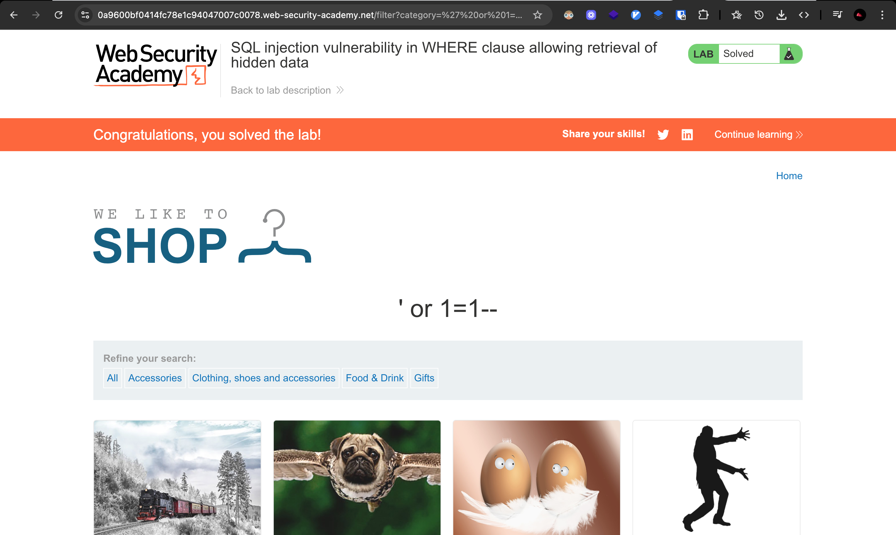

# Challenge:

Lab: SQL injection vulnerability in WHERE clause allowing retrieval of hidden data

## Challenge Description

This lab contains a SQL injection vulnerability in the product category filter. When the user selects a category, the application carries out a SQL query like the following:

```sql
SELECT \* FROM products WHERE category = 'Gifts' AND released = 1
```

To solve the lab, perform a SQL injection attack that causes the application to display one or more unreleased products.

## Resource

[Port Swigger - SQL Injection (retrieve hidden data)](https://portswigger.net/web-security/sql-injection/lab-retrieve-hidden-data)

## Step-by-Step Solution

1. **Akses Lab**
   Buka lab SQL injection untuk retrieve hidden data
   

2. **Test Category Filter**
   Coba melakukan filter berdasarkan categories untuk memahami fungsi normal aplikasi
   

3. **Inject SQL Payload**
   Masukkan payload SQL injection untuk mengakses data yang tersembunyi:

   ```
   ' or 1=1--
   ```

   **Penjelasan Payload:**

   - `'` - Menutup string parameter category
   - `or 1=1` - Kondisi yang selalu bernilai TRUE
   - `--` - Comment untuk mengabaikan sisa query (termasuk filter `released = 1`)

   **Cara Kerja:**

   - Query asli: `SELECT * FROM products WHERE category = 'Gifts' AND released = 1`
   - Query setelah injection: `SELECT * FROM products WHERE category = '' or 1=1--' AND released = 1`
   - Hasil: Mengembalikan semua produk termasuk yang unreleased (released = 0)

   

## Reflection

- **Status:** ✅ Berhasil
- **Root Cause:** Parameter category filter tidak memiliki validasi input yang proper untuk SQL injection
- **Attack Vector:** SQL injection melalui parameter category untuk bypass filter `released = 1`
- **Key Insight:**
  - Berhasil menggunakan SQL injection untuk bypass filter `released = 1` yang menyembunyikan produk unreleased
  - Payload `' or 1=1--` memungkinkan akses ke semua produk termasuk yang unreleased
  - Demonstrasi bagaimana SQL injection bisa digunakan untuk mengakses data yang seharusnya tidak terlihat
  - Teknik ini memungkinkan akses ke produk yang belum dirilis (unreleased products)
  - Kondisi `1=1` selalu bernilai TRUE, sehingga query mengembalikan semua data tanpa filter
