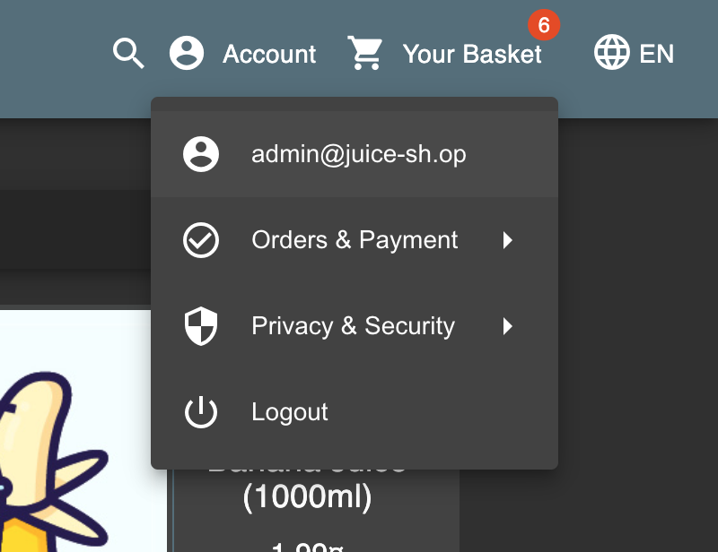
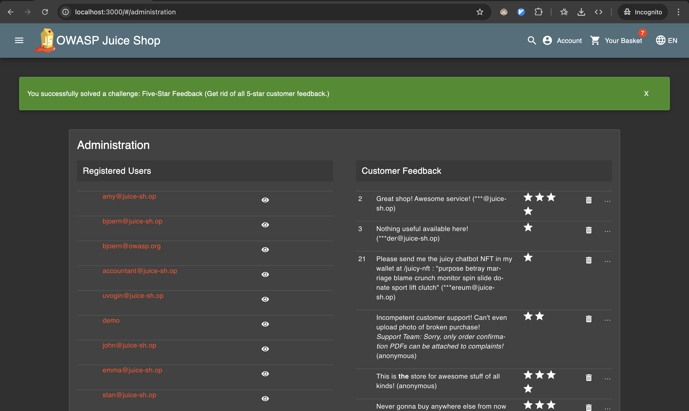

# Challenge: Five Star Feedback

Category: Broken Access Control
Points: 2 Stars
Difficulty: Easy

## Challenge Description

Delete any feedback that has been given by any user.

## Resource

[OWASP Juice Shop - Broken Access Control Challenges](https://juice-shop.herokuapp.com/#/score-board?categories=Broken%20Access%20Control)

## Step-by-Step Solution

1. **Login sebagai Administrator**
   Login menggunakan akun administrator (sudah dilakukan di challenge Login Admin sebelumnya)
   

2. **Identifikasi Tech Stack**
   Cek teknologi yang digunakan oleh website menggunakan extension Wappalyzer atau cari hint di website

   **Penjelasan:**

   - Identifikasi tech stack membantu memahami struktur aplikasi
   - Angular menggunakan routing berbasis URL untuk setiap komponen
   - Admin section kemungkinan memiliki route khusus

   

3. **Test Admin Routes**
   Karena menggunakan Angular, setiap komponen di-route menggunakan URL. Coba akses route admin yang umum:

   - `/admin` - Route yang umum digunakan
   - `/administration` - Route alternatif

   

   Tidak terjadi apa-apa ketika mengakses `/admin`, coba `/administration`

4. **Akses Admin Section**
   Berhasil mengakses halaman administration
   

5. **Hapus Five Star Feedback**
   Di halaman admin, cari dan hapus feedback yang memiliki rating 5 bintang

   **Penjelasan:**

   - Admin section memungkinkan akses ke semua feedback
   - Tidak ada validasi untuk memastikan hanya admin yang bisa menghapus feedback
   - Broken access control memungkinkan unauthorized deletion

   

## Reflection

- **Status:** ✅ Berhasil
- **Root Cause:** Admin section tidak memiliki proper access control untuk feedback deletion
- **Attack Vector:** Unauthorized access ke admin section untuk menghapus feedback user lain
- **Key Insight:**
  - Berhasil menggunakan route enumeration untuk menemukan admin section
  - Admin section memungkinkan akses ke semua feedback tanpa proper authorization
  - Demonstrasi bagaimana broken access control bisa digunakan untuk unauthorized data manipulation
  - Teknik ini memungkinkan attacker untuk menghapus feedback user lain
  - Route enumeration memungkinkan discovery of administrative functionality
  - Vulnerability ini berbahaya karena memungkinkan akses ke administrative functions dan data manipulation
